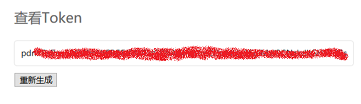

# 接口示例

### 获取用户Token 
在产品网站中用户个人中心查看 Token。 Token 需要通过 header 传递过去。

用户登录界面后，进入用户中心即可查看Token。



### 创建二级用户

请求示例：

```
curl "http://cloud.zetyun.com/user" -H "X-Access-Token: token" -d "name=userName&email=usermail@some.com&password=123456"
```

响应示例：

```
{
	"code": 0,
	"data": {
		"autoKey": "85",
		"name": "pana101",
		"pwdhash": "e10adc3949ba59abbe56e057f20f883e",
		"email": "hellos@some.com",
		"avatar": null,
		"token": null,
		"createtime": "2015-10-29T09:11:03.052Z",
		"status": 0,
		"group": 1,
		"info": null,
		"phone": null,
		"ehcUser": null
	}
}
```


### 模块列表接口

请求示例：

```
curl "http://cloud.zetyun.com/tf/module/list?moduleType=module&num=10&order_key=&order_by=DESC" -H "X-Access-Token: token"
```

响应示例：

```
{
	code: 0,
	data: [{
    id: 30,
    name: "VECM",
    description: "A statistical model",
    version: "0.4",
    versionId: 4,
    lastModifyTime: "2016-05-11T09:16:42.311Z",
    creator: "admin",
    style: {
        classname: "f_shape drag f_shape_blue"
    },
    templateType: 0,
    spec: {
        Name: "VECM",
        Description: "A statistical model",
        Version: "0.4",
        CategoryTags: [
            "Basic",
            "R"
        ],
        Cmd: "Rscript main.R",
        Param: {
            Type_of_deterministic_regressor: {
                Default: "const",
                Type: "string"
            },
            Type_of_estimator: {
                Default: "ML",
                Type: "string"
            },
            Type_of_longterm_deterministic_regressor: {
                Default: "none",
                Type: "string"
            }
        },
        Input: {
            Input_file: [
                "raw.csv"
            ]
        },
        Output: {
            Output_file: [
                "raw.csv"
            ]
        }
    },
    type: 0,
    tags: [
        "Basic",
        "R"
    ],
    refNum: 2
}]
}
```


### 创建 job
请求示例：

```
curl "http://cloud.zetyun.com/tf/job/run/:projectId" -H "X-Access-Token: token" -d "name=jobName&description=job description"
```

响应示例：

```
{
    "code": 0,
    "data": {
        "autoKey": 459,
        "projectId": 152,
        "projectVersionId": 1,
        "startTime": null,
        "endTime": null,
        "status": 0,
        "name": "testjob",
        "creator": 1,
        "description": "testjob",
        "createdTime": "2016-05-12T07:20:28.634Z",
        "opStatus": 0,
        "env": "",
        "variable": [],
        "isPrivate": true,
        "notification": {
            "to": [],
            "cc": []
        },
        "extension": null,
        "isIncremental": true,
        "sourceId": 0
    }
}
```

