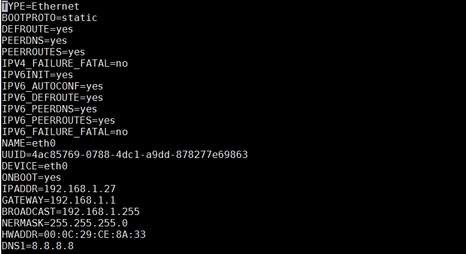
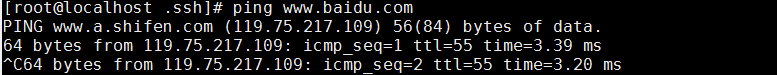
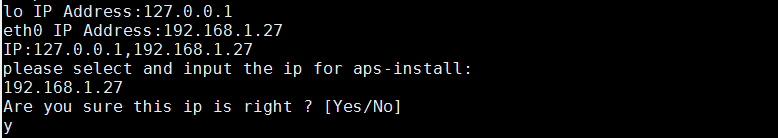
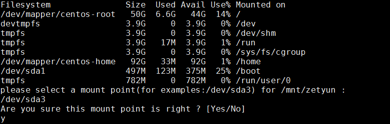
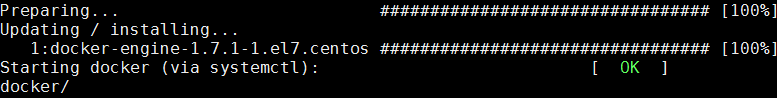
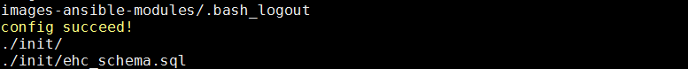
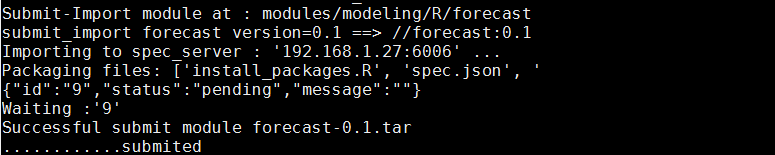
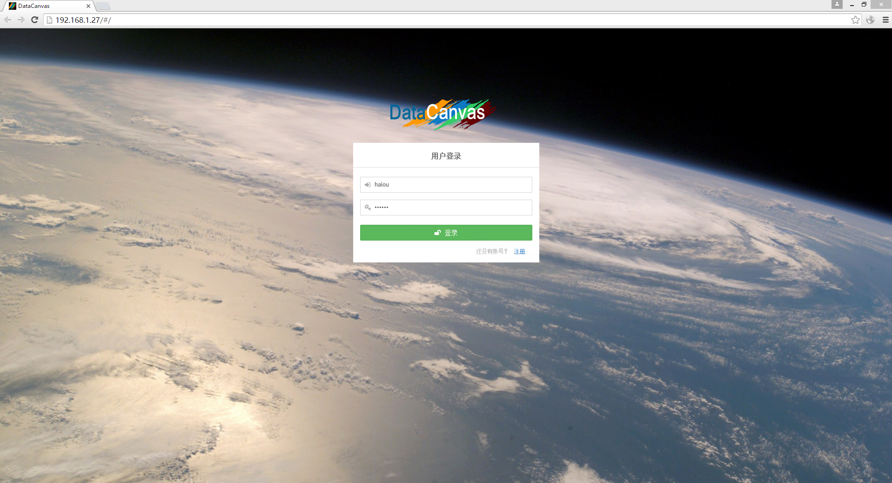
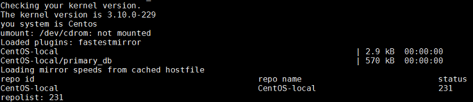

#DataCanvas APS 安装手册

### 环境要求

为保证APS安装成功，需要对操作系统、网络环境、机器配置有最低要求。

####机器配置要求

* CPU要求：一个CPU，双个CPU核 
* 内存要求：8GB+ 
* 硬盘要求：100G+ 

####操作系统要求：

* 操作系统版本：CentOS7 64位版本 
* 内核版本：3.1版本 

####最小集群配置要求：

* 节点数量：APS安装在某一个节点上 
* 网络环境：连接外网或者配置本地YUM源，满足有网环境部署或无网环境部署 
* 磁盘挂载：单台机器上可能有多块磁盘，挂载一块至少50G+的磁盘以满足APS部署 

###安装包说明：

####查看安装包

有网环境：

安装脚本：

    
无网环境：

 
安装脚本：

 
####一键安装

**有网环境**

备注：如果本机默认网卡配置能够ping通外网就可开始部署。以下网卡配置仅供参考。

配置好/etc/sysconfig/network-scripts/ifcfg-eth0,参考如下：

重启网卡：

     $Service network restart

使用ifconfig命令验证：

     $Ifconfig

确定可以ping通网络：

然后，上传安装包aps-installer.tar.gz和安装脚本check_os.sh到机器指定目录/usr/lib/下，运行check_os.sh脚本，开始部署APS。

APS部署细节：

选择要部署APS的目标机IP

选择挂载/mnt/zetyun的磁盘（如/mnt/ehc）

成功安装docker

完成APS的部署配置

成功启动docker-registry
 

创建datacanvas user,依次输入用户名/密码/email
 

成功提交9个modules

结果验证：

在浏览器输入所安装APS机器的IP，使用用户创建的datacanvas user帐户登录APS平台，登录成功后即可使用APS平台，使用手册参见
<a href="../../DataCanvas opera/operational guidance.md">3、DataCanvas 操作指导</a> 

**无网环境**

上传无网环境部署的APS安装包aps-installer.tar.gz和安装脚本check_os.sh到机器指定目录/usr/lib下，运行check_os.sh脚本，开始部署APS。

无网环境部署同有网环境部署基本一致，只需注意的是，在运行无网环境一键脚本时，首先会配置本地yum源CentOS-local。

之后的部署细节同有网环境。
