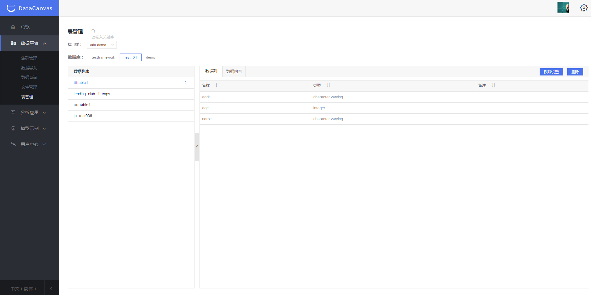
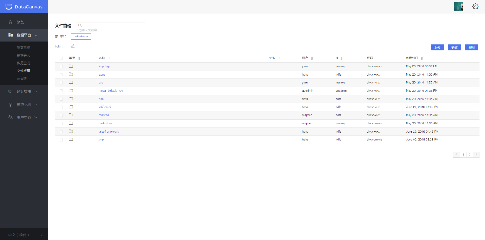

#数据平台使用指导
###集群管理
####新建集群
单击左侧导航栏，选择“数据平台>集群管理”，系统自动跳转到集群管理界面。单击“新建”用户可创建集群，用户根据需求填写相关信息。

 

说明：如果用户为私有部署请选择“类型”为“私有”，私有部署请联系我们工程师。

单击“下一步”，自动跳转到“添加”界面，用户根据需求选择区域、主节点类型、从节点类型、扩展从节点数量，单击“新建”，如下图：

说明：在进行大量数据的批量导入导出时，如果源(目的)数据库和EDS处于不同网络环境，带宽上限和网络状况往往是制约导入速度的最主要因素，导入时间(S)>=数据总量(MB)/可用带宽(MB/s)。在网络质量较差时，也会出现导入(导出)超时或失败的现象。如果源（目的）数据库和EDS间网络环境稳定，甚或处于同一网络或者通过专线连接，导入（导出）速度也会受到两端服务器硬件配置（磁盘I/O性能等）影响。

####集群管理

集群创建完成后，通过集群列表可查看集群序号、IP、名称、描述、生命周期类型、状态和创建时间等信息。单击操作下的编辑图标，可对集群名称和描述进行编辑。

说明：集群状态包括：等待、创建中、启动中、运行中、重启中、停止中、已停止、删除中、已删除、未知、异常等11种状态。

单击某个集群序号，系统跳转到集群界面，可对该集群进行运维、停止、启动和权限设置等操作，可弹性释放资源，优化资源利用率。

###数据导入

数据导入支持多种类型的数据源导入。比如：关系型数据库（MySQL/Oracle等）、NoSQL数据库（Mongodb/Cassandra等）、文件（excel/csv/ftp等）。如下图，用户还可以查看已导入的数据信息。单击名称，可查看导入详情。单击目标数据，可查看导入的数据库的表字段及表数据。封装则为用户提供了进一步管理数据资产的功能，可将导入的数据封装成模块直接在以后的分析中应用。

导入MySQL数据库示例：

单击MySQL图标，可导入MySQL类型数据库。

数据配置信息、源数据、目标数据、任务描述填写完成后，单击导入，系统会自动跳转到表管理界面，可查看刚刚导入的数据。

###数据查询

“数据查询”为用户提供了数据库可视化操作的平台界面，同时，提供可视化操作EDS数据库和轻量、高效的抽样数据分析功能，支持SQL语句操作数据库，支持数据的导入、导出和分析等操作，适用于编写算法模块前期的探索工作。用户可以在“探索”功能中实现SQL查询、shell、Distcp等多种任务在不同EDS集群上的远程执行和实时交互，同时，数据查询内置数据可视化，支持自定义可视化类型。

查询命令示例：
查询集群eds-demo中spdbank中的数据。系统快速执行命令并展示结果，同时，用户可通过添加新视图自定义结果的展示形式。

###文件管理

文件管理页面可以查看和管理用户所创建的集群的HDFS文件。

页面支持从本地上传文件，新建文件夹。

       说明：上传文件和新建文件夹时需要进到home目录或者在share文件夹下进行。

###表管理

表管理支持对集群内的数据库进行查看和管理。同时支持对数据库内的表格进行权限设置，包括对某个表进行用户、用户分组以及读取、创建、编辑、删除等权限设置。

###调度器管理

用于管理数据平台的集群资源，可创建不同的队列并分配资源大小和最大任务数等参数，用户在提交任务时指定某个队列就会使用这个队列的资源运行任务，非常直观的观察集群资源使用情况以及正在运行的任务。

