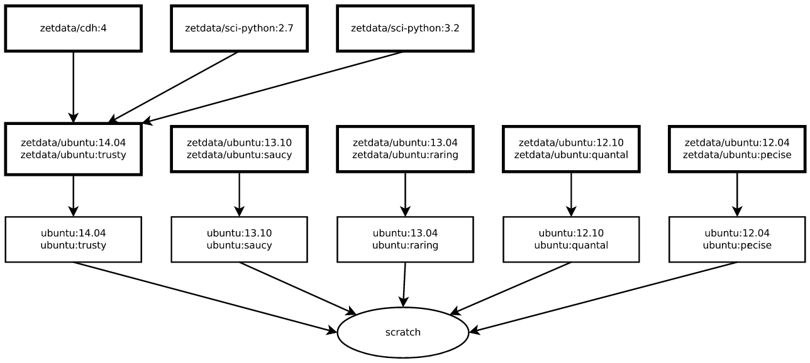

#基础映像

###<a name="id1">为什么使用基础镜像？</a>

Docker 提供了一个开放的平台用来编译，发布封装的映像。官方提供的 映像可能无法直接满足现有需求，进行模块封装，根据以下原因我们设计自己的基础映像：

1. 基础映像提供了一些最基本的应用，例如 `zetdata/cdh:4` 是CDH4 Hadoop cluster的基础映像。 `zetdata/sci-python:2.7 ` 映像提供了[ scikit-learn](http://scikit-learn.org/) 机器学习工具包。
2. 节省带宽资源。当然，你可以从头开始建立你自己的模块。Docker支持增量拖拽，可以从远程服务器上进行拖拽，这样就节省你的带宽和时间。
3. 所有编译基础映像的脚本会在 [github repo](https://github.com/DataCanvasIO/docker-brew-datacanvas-base), 上开源，映像会推送到 [official docker registry](https://hub.docker.com/u/zetdata/) 的官方。

###<a name="id2">Hierarchy of base images</a>

