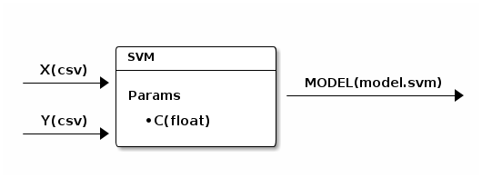

#开始使用Screwjack(基本版)

Before you trying following, you should ensure screwjack is installed. Please refer Introduction for detail installation steps.

###<a name="id1">步骤1：初始化模块</a>

假设创建一个基本模块，提供非常基本的功能。如果想创建一个“Hive”模块， 请参阅文件： <a href="Getting Started2.md">使用ScrewJack（Hive）</a>。

创建一个基本模块 `screwjack `:
```
screwjack init basic --name="SVM" --description="A simple SVM"
```
随后会提示设置其他选项，如下所示。在本教程中，我们使用scikit-learn,它已被封装在基本软件包 `zetdata／SCI Python：2.7 `。
```
Module Version [0.1]:
Module Entry Command [/usr/bin/python main.py]:
Base Image [zetdata/ubuntu:trusty]: zetdata/sci-python:2.7
Sucessfully created 'svm'
```
也可以使用如下命令行：
```
screwjack init basic --name=SVM --description="A simple SVM" --version="0.1" --cmd="/usr/bin/python main.py" --base-image="zetdata/sci-python:2.7"
```
你会得到一个基本模块，并被赋予了初始版本号。
```
svm
|-- Dockerfile
|-- main.py
|-- spec.json
`-- specparser.py

0 directories, 4 files
```
切换到新模块目录，如下步骤是基于这个工作目录进行的.
```
cd svm
```
###<a name="id2">步骤2：添加输入/输出/参数</a>

如果创建模块需要两个 输入, 一个 输出, 和一个参数。如下图所示:



用以下命令添加一个参数：
```
screwjack param_add C
```
用下列命令添加两个输入，第一个参数 X 指的是输入/输出名称，第二个参数 csv 指的是 输入/输出的类型。类型可以是任意用户定义的字符串，如”csv”, “hive.hdfs.table:sub:x“。 关于类型的更多信息，可以参考文件 *输入输出类型 <io-types> 部分*。

```
screwjack input_add X csv
screwjack input_add Y csv
```
最后，输出为：
```
screwjack output_add model model.svm
```

###<a name="id3">步骤3：实现代码</a>

现在，你可以实现代码如下：
```
vim main.py
```
在本教程中，我们将实现 `main.py` ：
```
from specparser import get_settings_from_file

from sklearn.svm import LinearSVC
import numpy as np
import pickle

def main():
    settings = get_settings_from_file("spec.json")
    X = np.genfromtxt(settings.Input.X, delimiter=',', skip_header=1)
    Y = np.genfromtxt(settings.Input.Y, delimiter=',', skip_header=1)
    svc = LinearSVC(C=float(settings.Param.C))
    svc.fit(X,Y)
    with open(settings.Output.MODEL, "w") as f:
        pickle.dump(svc, f)
    print("Done")

if __name__ == "__main__":
    main()
```
如果你想在本模块中添加其他文件，可以直接添加在 `Dockerfile` 中。
```
vim Dockerfile
```
如果有其它文件添加，可以通过如下命令行加入 `Dockerfile` ：
```
ADD your_additional_file /home/run/
```
如果需要添加额外目录，可以使用如下命令：
```
ADD your_additional_folder /home/run/your_additional_folder
```
如需更多资料，请参考 [Dockerfile](http://docs.docker.io/reference/builder/).

###<a name="id41">步骤4.1：本地测试</a>

将代码写入模块后，可以通过``screwjack run``进行测试。
```
screwjack run local --help

Usage: screwjack run local [OPTIONS]
Options:
  --param-C TEXT  Param(string)
  --X TEXT        Input
  --Y TEXT        Input
  --MODEL TEXT    Output
  --help          Show this message and exit.
```
我们可以在本地环境进行测试，这个测试环境与实际开发环境比较相似。
```
screwjack run local --param-C=0.1 --X=a.csv --Y=b.csv --MODEL=tmp.model
```
###<a name="id41">步骤4.2 在**docker**中进行测试</a>

然后，我们可以尝试在docker中执行模块
```
screwjack run docker --param-C=0.1 --X=a.csv --Y=b.csv --MODEL=tmp.model
```
###<a name="id5">步骤5：提交模块</a>

你首先提供 spec_server 的URL地址用来提交：
```
screwjack submit
```
