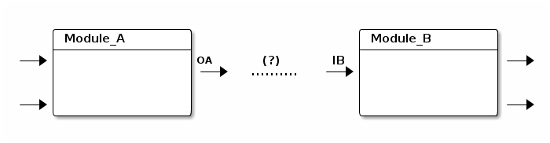

#输入/输出类型

###<a name="id1">为什么需要类型？</a>

如上图所示，如果两个模块之间需要数据交互，如何是否能将它们连接在一起？模块A输出 OA 会 写入 [csv](http://en.wikipedia.org/wiki/Comma-separated_values), 模块B的输入会读取 [tsv](http://en.wikipedia.org/wiki/Tab-separated_values), ‘module_A’ 与’module_B’之间的数据类型不一致会导致任务的失败。

所以我们可以借助 [Union Type](http://en.wikipedia.org/wiki/Union_type) 设计和规范模块 的输入和输出类型。在DataCanvas数据工作流中，前端也提供了输入与输出类型的检查。

一个简单的类型就是一个字符串，例如， “csv”, “csv.salary.table”, “hive.table.tf”。简单类型 是大小写敏感的。两个输入/输出的类型不为空并且类型一致才可以连接。

类型将有助于建立正确的模块间连接。某些错误的使用方式包括：

　　1. 对很多模块使用相同类型的，这将使类型检查形同虚设。 
　　2. 选择有意义的类型名称。一些类型的名字信息很少，”hive.table.A”，不利于模块的正常使用。

