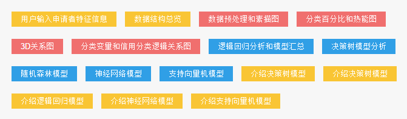
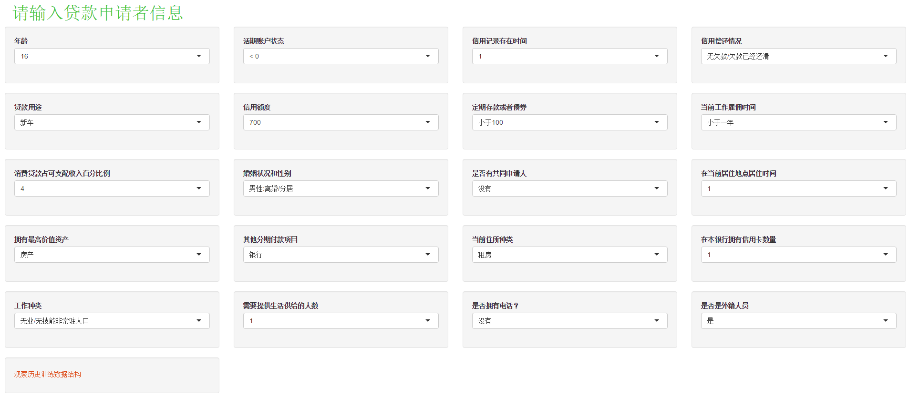
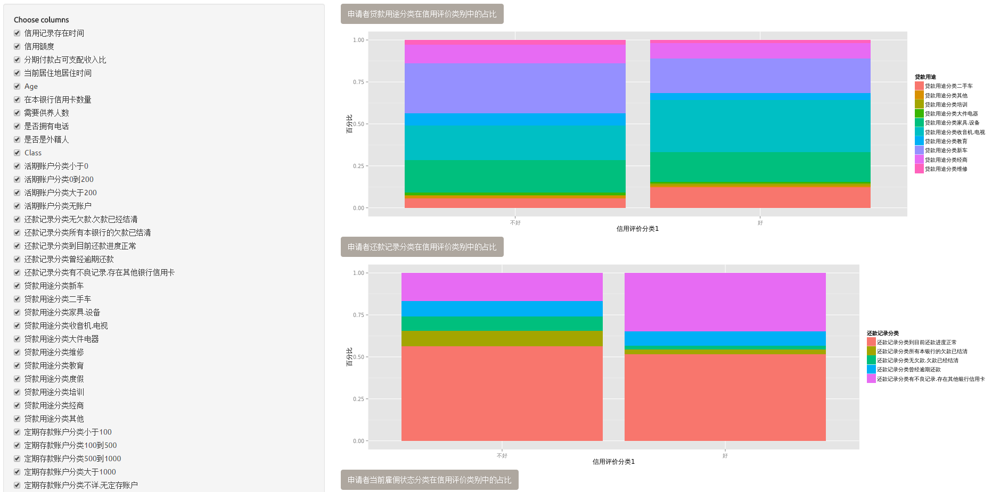
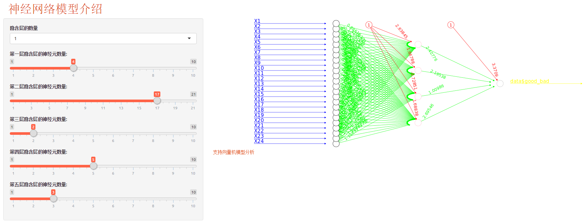

#模型示例

###深度机器学习
可进行深度机器学习的探索工作。

###信贷模型分析
**信贷模型分析**

界面展示了机器学习建模流程，列举了机器学习建模分析结果的可视化展现形式，并对机器学习典型模型做了清晰的图文介绍和模拟应用，旨在帮助用户快速了解机器学习算法，并通过典型模型的模拟应用使用户感知机器学习建模分析中的参数选择和逻辑思路。

DataCanvas以信贷风险评估模型为例，通过“用户输入申请者特征信息”填写参数；“数据结构总览”可以查看数据源并选择模型参数；“数据预处理和素描图”、“分类百分比和热能图”、“3D关系图”为数据分析图形化界面，用户可通过更换变量、增减参数感知图形变化，了解数据趋势；“逻辑回归分析和模型汇总”、“决策树模型分析”、“随机森林模型”、“神经网络模型”、“支持向量机模型”分别介绍了各类模型的分析算法及公式，并对分析结果进行对比，帮助用户深入了解机器学习算法，并通过对比做出最佳判断。

