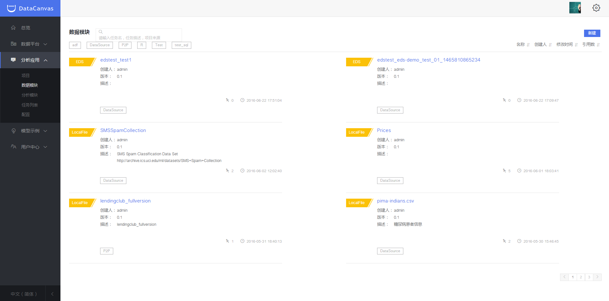
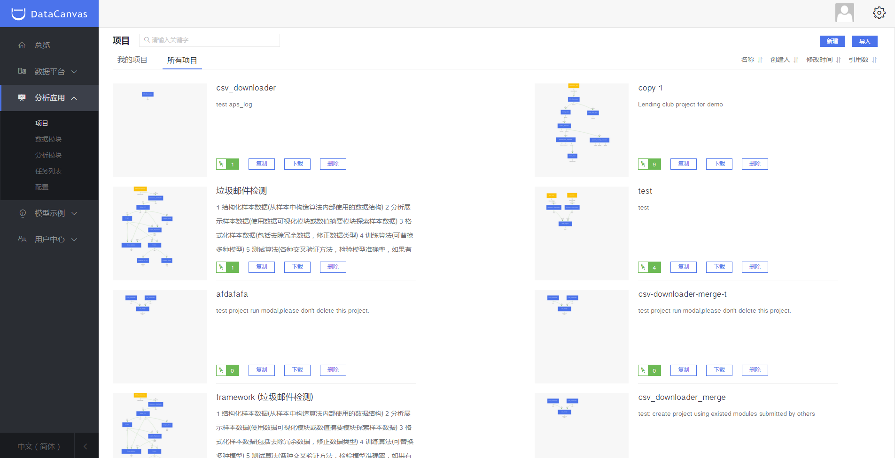
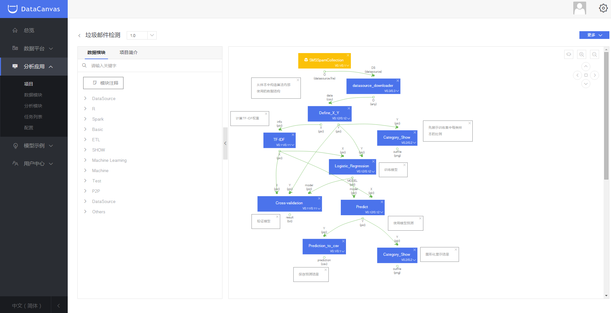
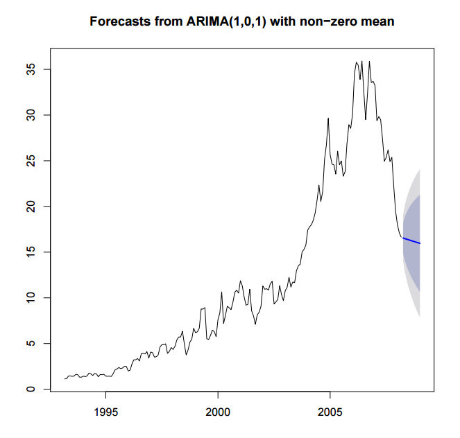

#分析平台使用指导
###数据平台功能简介
* 
项目：实现某种具体商业需求的数据分析流。
* 
模块：实现数据操作的最小单位，包括数据模块和分析模块，有可能是数据的导入导出；可能是针对数据库的某种操作，或者是使用某种机器学习算法对数据的处理和运算。
* 
交互式探索：使用户能够方便直观的进行数据探索，高效实用机器学习算法进行分析，实时呈现分析结果，从而帮助用户解决实际业务中的问题。
*
算法定制：支持通过R、Python、Hive、Pig等进行轻量级的模块开发和编辑。
* 
任务列表：是项目运行后的结果列表。
* 
可视化：系统可以提供饼图、柱状图、折线图等常见图形来满足不同的展示和分析需求。
* 
API发布：对数据或算法模型进行封装，以RESTAPI的方式提供外部调用接口。

###数据模块管理
DataCanvas内置部分开源模块库，用户可直接使用，模块功能可参见模块下方的简要说明。
单击左侧导航栏“分析应用>数据模块”，系统跳转到数据模块界面，可对数据源模块进行查看和新建，通过点击上方分类标签进行模块筛选。
单击模块名称，可查看数据模块详情、历史记录、引用记录等，并支持对该模块进行评论。

单击“新建”，用户可根据自身需求创建数据源模块。

说明：数据源类型支持LocalFile/Http/Ftp/AWS S3/HDFS/HIVE/DB/EDS。

###分析模块管理

单击左侧导航栏“分析应用>分析模块”，系统跳转到分析模块界面，可对数据源模块进行查看和新建，通过点击上方分类标签进行模块筛选。
单击模块名称，可查看数据模块详情、历史记录、引用记录等，并支持对该模块进行评论与下载。

####编辑模块

单击模块可编辑模块并查看模块详情、历史记录和引用记录等信息。单击标签编辑图标，可以修改、新增标签信息。

说明：
* 通过页面新建的模块支持编辑；通过Screwjack工具编写的模块暂不支持在界面进行编辑。
* 用户只能对自己创建的模块进行编辑、权限设置和删除等操作，其他用户创建的模块仅拥有查看权限。

####新建模块

DataCanvas支持用户自定义模块，包括以下两种方式：
* 
DataCanvas支持在页面上简单快速的进行轻量级模块的开发和编辑。
* 
DataCanvas提供了专门的模块开发工具Screwjack，用于复杂脚本的编写、测试及导入，单击界面右上方帮助问号可获取Screwjack工具包及使用方法。

(备注：Screwjack已在Github中开源，链接地址：https://github.com/DataCanvasIO/screwjack。

下面以创建分析模块为例：
进入分析模块界面，单击页面右上方“新建”按钮，开启创建模块引导，帮助用户快速定义模块的输入、输出和参数配置。模块生成后将自动上传至DataCanvas模块库，供工程调用。

说明：页面仅支持Hive/Pig/Hadoop_Jar/Python/SCI_Python/R语言编写轻量级模块，在“选择类型”下拉框中可见。如需采用其他语言编程请使用Screwjack工具，工具包获取及使用方法参加界面右上方帮助问号。

###项目管理

单击左侧导航栏“项目”，页面跳转到“项目”页签，可查看、导入和创建项目信息。DataCanvas内置部分项目工程，用户可直接使用。

单击项目画布，可查看当前项目版本号及模块信息，也可以根据需求编辑项目。单击页面右上方更多按钮，弹出下拉框，可进行如下操作：
* 
创建项目：创建新的项目工作流。
* 
打开项目：用户可打开其他项目流程，可选择是否保存当前项目。
* 
变量设置：用户可设置全局变量。全局变量可供用户在创建分析模块时引用。
* 
数据环境：用户可选择数据环境，数据环境为全局变量的集合。
* 
编辑项目：可对项目名称、描述进行编辑，支持取消共享。
* 
复制项目：可对项目进行复制。
* 
权限设置：支持对本项目的用户、用户分组及读取、创建、编辑、删除等权限进行设置。
* 
引用记录：用户可查看项目运行记录。

####编辑已有项目
用户可根据自身需求编辑项目流程，编辑完成保存后，系统会自动更新版本号 。

说明：用户需提前获取该项目的编辑权限。

双击项目中的模块，用户可对模块配置进行编辑，保存后系统自动更新版本号。

####新建项目

单击“创建项目”，用户可根据需求新建项目。名称和描述填写完成后，单击“创建”，页面跳转到创建项目页面。

用户将鼠标置于“第一个模块”处可弹出加号，通过单击加号，系统自动弹出模块下拉框，下拉框中模块已自动匹配上级模块的输出类型，便于用户选取。

同时，平台支持直接从左侧模块库中拖拽模块至工作区域，在确保模块输入类型与上级模块的输出类型相匹配的情况下将功能模块通过数据耦合的方式连接在一起，形成分析工作流。

####创建任务

流程创建完成后，单击保存，系统自动生成版本号，单击“运行”弹出如下对话框，用户可自定义任务运行模式。

单击运行后，自动跳转到任务界面，查看当前项目运行状态。

###交互式探索 

交互式探索可作为用户创建分析模块的前期探索工作；对于在“交互式探索”中有价值的查询或算法，通过控制台的算法定制，用户均可以将其固化为模块，经过简单的页面拖拽即可实现数据的清洗、挖掘、分析和可视化，并托管在分析平台之上进行工作流的控制以及定期的调度。

交互式探索具备以下优势：
* 
交互式数据探索，即刻获取分析结果，可多任务同时运行；
* 
内置常用的数据分析和机器学习算法，可直接调用运行，方便数据团队协同与共享；
* 
支持多种分析语言，Scala(使用Apache Spark)、Python(Apache Spark)、Spark SQL、Hive、Markdown、Shell等等；使用者可选择自己擅长的任意一种语言进行分析探索和挖掘，提高了数据分析的舒适度，降低数据分析的语言门槛。
* 
内置多种可视化效果，使用者可选择最优展现形式。

###算法定制 

算法定制是指用户可以选择Hive、Pig、Hadoop_Jar、Python、SCI_Python和R语言来编写轻量级应用分析模块。

在左侧导航栏中选择“应用分析->算法定制”，点击您想使用的开发语言的图标，然后定义模块的输入、输出等参数配置，点击“应用修改”按钮创建代码块。代码块会显示在右侧文本框中，上传数据文件后点击“创建模块”。模块生成后将自动上传至DataCanvas模块库，供工程调用，且会显示在“算法定制”页面的下方列表中。以R语言为例：

###查看任务

单击“任务列表”页签可查看运行后的全部任务，任务状态分为：等待、运行、异常、已暂停、已终止、完成。

    说明：任务异常可能是链接超时网络中断或者模块逻辑自身错误，请根据以上原因进行排查。

单击任务名，可查看任务的流程图、模块列表、变量配置和运行日志。

任务流程图中，双击模块可查看当前模块的运行结果和日志，便于定位问题。

双击结果输出模块，查看项目运行的可视化结果。

###可视化

系统可以提供饼图、柱状图、折线图等常见图形来满足不同的展示和分析需求。

###API发布

对数据或算法模型进行封装，以RESTAPI的方式提供外部调用接口。

