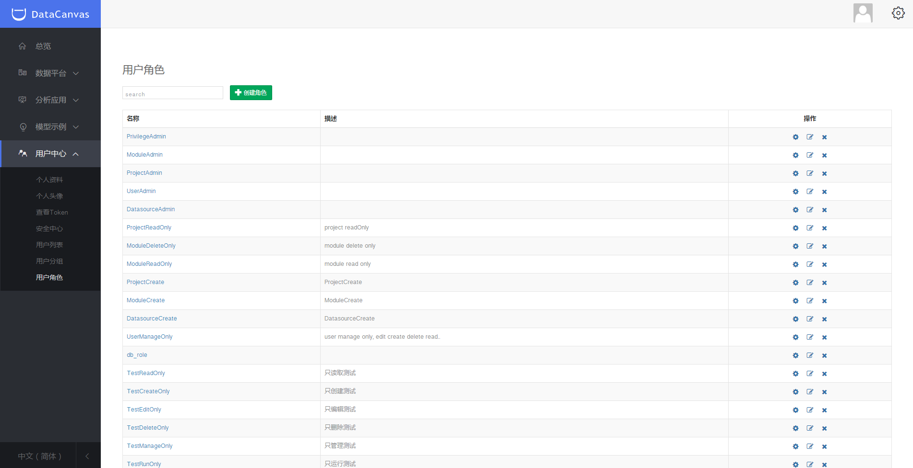
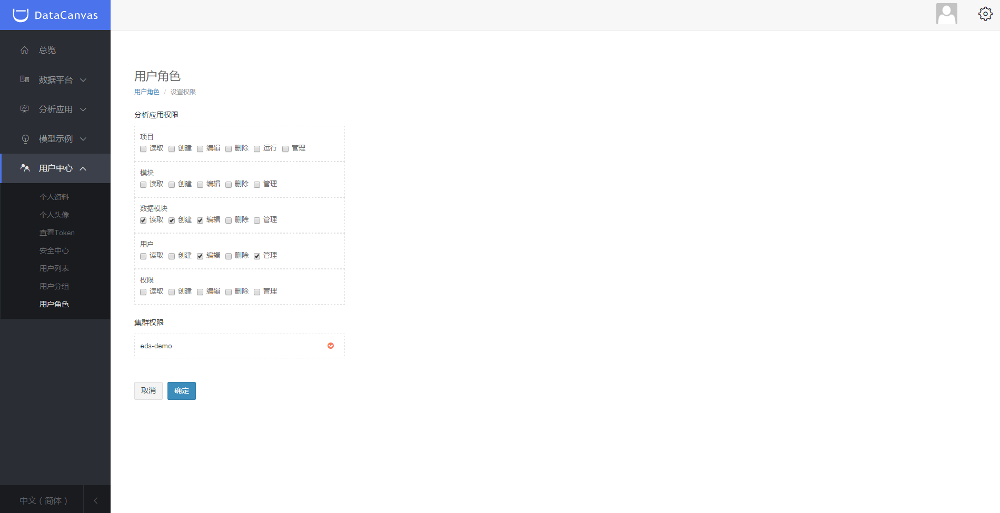

#用户管理
单击页面左上方功能按钮，选择“管理”，跳转到“管理”页面，用户可对个人资料、头像和密码进行修改、查看Token，创建二级用户，并支持用户权限管理。

###权限管理

DataCanvas支持多种不同的权限，用户根据需求加入不同的管理组同时被赋予相应的权限。

* 二级用户

管理员用户拥有创建二级用户权限，二级用户仅能对平台进行权限范围内的操作，如需更多操作需要向管理员用户申请增加权限。

* 用户分组

在某一分组内的用户仅能进行该分组权限分为内的操作。平台预置部分用户分组，同时支持新建。

单击“操作”下的“编辑”按钮，可以对用户角色进行编辑。

* 用户角色

在某种用户角色内，被赋予了相关权限；平台预置部分用户角色，同时支持编辑和新建。

单击“操作”下的“设置”按钮，可对应用权限和集群权限进行编辑。

